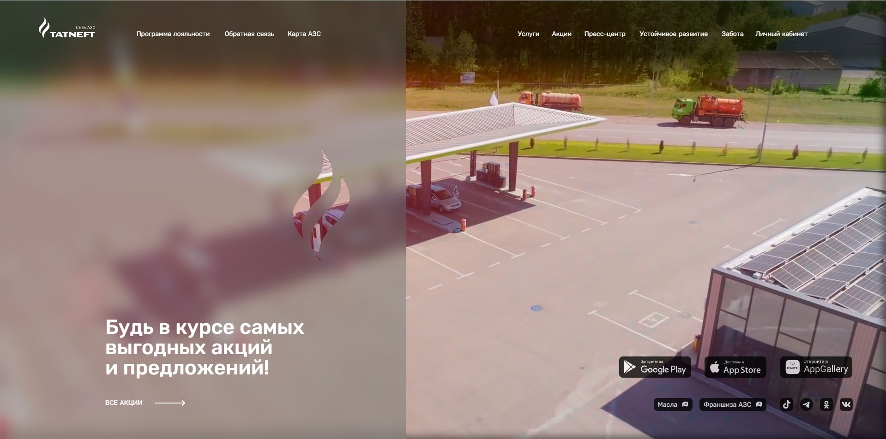
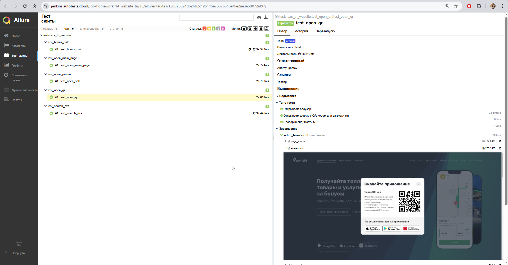
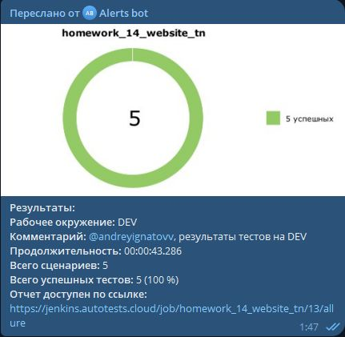

## Автотесты по проекту "Информационный сайт АЗС Татнефть"
[Ссылка на сайт АЗС Татнефть](https://azs.tatneft.ru/)


___

## Список кейсов по тестированию (UI-тесты)
1. Калькуляция бонусов в зависимости от трат пользователя (test_bonus_calc.py)
2. Открытие главной страницы и отображение основных элементов (test_open_main_page.py)
3. Открытие страницы промо и отображение акций (test_open_promo.py)
4. Отображение QR-кода для перехода в магазин приложений (test_open_qr.py)
5. Проверка поиска АЗС на карте (test_search_azs.py)

___

## Используемый стек: 
<a href="https://github.com/allure-framework">
 
</a>

<a href="https://www.jenkins.io/">

</a>

<a href="https://github.com/pytest-dev">

</a>

<a href="https://www.python.org/downloads/">

</a>

<a href="https://github.com/yashaka/selene">

</a>

<a href="https://github.com/aerokube/selenoid">

</a>

<a href="https://web.telegram.org/a/">

</a>

___

## Запуск автотестов

### Удаленно

* Открыть проект в [Jenkins](https://jenkins.autotests.cloud/job/homework_14_website_tn/)
* Перейти в раздел `Build with Parameters`
* В поле `Выбор запуска тестов` выбрать `tests/azs_tn_website` для запуска всех тестов или выбрать конкретный
* В поле `Браузер по умолчанию` выбрать версию браузера (Доступно: 127.0, 128.0)
* В поле `Environment` выбрать среду запуска (Доступно: dev, stage, prod)
* В поле `Comment` указать текст, который нужно отобразать в телеграмм-боте в результатах теста
* Нажать `Build`
* Дождаться окончания прогона автотестов (статус можно отследить слева под боковым меню в блоке `Build`)
* После завершения появляется кнопка `Allure` (иконка), при нажатии открывается отчет

#### Пример отчета Allure:


#### Пример отчета в Телеграмм-бот:


### Локально

* В проекте создать файл .env c данными
```
SELENOID_LOGIN="user1"
SELENOID_PASS="1234"
```
* Запустить команду для установки библиотек
```
Pip install –r requirements.txt
```
* Установить интерпритатор (через консоль или pycharm)
```
python -m venv .venv
source .venv/bin/activate
```
* Запуск теста
```
pytest tests/demoqa/test_registration_form.py --browser_version=128
```
* Вывод результатов в локальном allure
```
allure serve tests/azs_tn_website/allure-results
```


